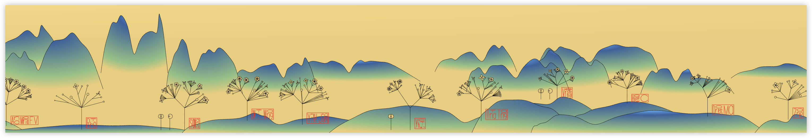

# {Mountains, Trees}\*

A procedurally generated infinite landscape by [Find the Tree in Your Name](https://tree.bairui.dev) participants in [ITP Spring 2025](https://itp.nyu.edu/shows/spring2025/projects/#11830-find-the-tree-in-your-name), inspired by [{Shan, Shui}\*](https://github.com/LingDong-/shan-shui-inf) and created by [APack](https://apack.bairui.dev/), [Charming.js](https://charmingjs.org/) and [D3.js](https://d3js.org/).

Thanksgiving 2024, I explored an infinite landscape made of triangles.

Later, I added colors to it inspired by the Chinese painting [A Thousand Li of Rivers and Mountains](https://en.wikipedia.org/wiki/Wang_Ximeng).

For Thanksgiving 2025, I wanted to go a step further. What fascinates me is that the ones who plant the trees become part of the trees—the creators are part of the creation. The stamps generated by APack serve as a mark of authorship!

Huge thanks to all the lovely people who planted their trees. Come find yours in the landscape! 🌳✨
